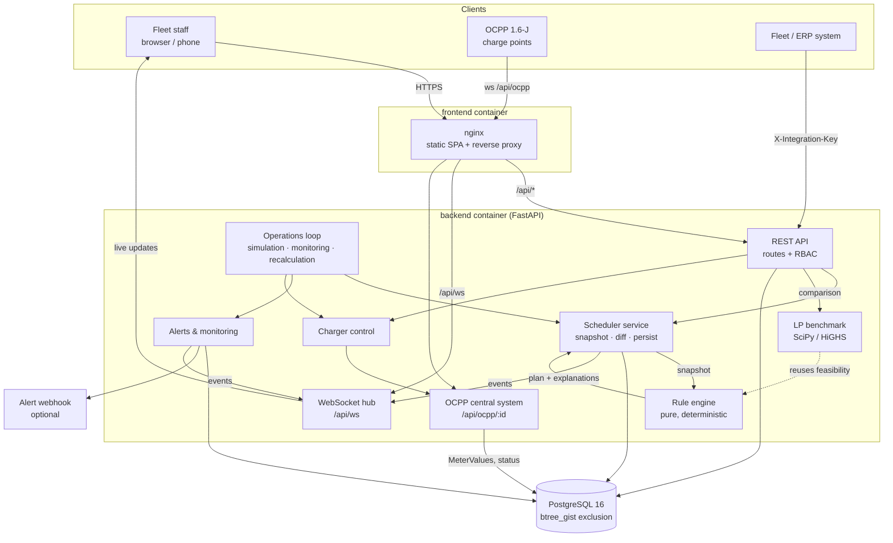

# Architecture

## System Architecture

ChargeOpt runs as three containers under Docker Compose: PostgreSQL, a FastAPI backend and an nginx container serving the React app. nginx is the only exposed port. It serves the static frontend and proxies `/api/*` (REST, the browser WebSocket and the OCPP WebSocket) to the backend, so the browser only ever talks to one origin.

Inside the backend, the scheduling engine is a pure module with no I/O. Everything stateful (reading the fleet snapshot, writing reservations, raising alerts, talking to chargers) sits around it in service modules. A single background loop drives everything time-based.

## Components

| Component | Technology | Responsibility |
|---|---|---|
| Frontend | React 18, TypeScript, Vite, Tailwind CSS, TanStack Query, Recharts, React-Leaflet | 15 screens plus login: overview, schedule (timeline, decisions, baseline comparison and run history tabs), charging ops, alerts, vehicles, vehicle detail, trips & drivers, map, energy & cost, reports, depots & chargers, tariffs, settings, audit log and the driver view. Permission-aware navigation. WebSocket live updates with a 30 s polling fallback. |
| Web server | nginx | Serves the built SPA, proxies `/api` and WebSockets to the backend, sets CSP and security headers. |
| REST API | FastAPI, Pydantic 2 | Auth, fleet, trips, infrastructure, tariffs, scheduling, sessions, alerts, reports, admin, simulation and integration endpoints. OpenAPI docs at `/api/docs`. |
| Rule engine | Python (`services/scheduler/engine.py`) | Pure function: fleet snapshot → decisions, reservations, metrics and explanations. Implements rules R1–R8 and priorities P1–P5. Also runs the static baseline mode for comparison. |
| Scheduler service | Python (`services/scheduler/service.py`) | Builds the snapshot from the database, runs the engine, diffs against existing reservations (keep / create / supersede), records each `ScheduleRun`, handles the approval workflow and event-triggered recalculation. |
| LP benchmark | SciPy `linprog` (HiGHS) | Solves the continuous relaxation of the same problem to get a cost lower bound, used to report the rule engine's optimality gap. |
| Operations loop | asyncio background task | Every tick (5 s by default): starts due sessions, advances simulated charging, handles trip departures and returns, releases missed slots, evaluates alerts, snapshots readiness, and triggers periodic recalculation. Uses PostgreSQL advisory locks so multiple replicas don't process the same tick twice. |
| OCPP central system | WebSockets, OCPP 1.6-J | Accepts charge-point connections and sends `RemoteStartTransaction`, `RemoteStopTransaction`, `SetChargingProfile` and `ChangeAvailability`. Stores `MeterValues` as `source = ocpp`. A bundled emulator (`app/tools/ocpp_charge_point.py`) is included for testing. |
| Monitoring & alerts | Python | Readiness metrics, eight alert types with deduplication and auto-resolve, acknowledge/resolve workflow, optional webhook delivery. |
| Advisory | Python | Rule-based contingency suggestions (nearest compatible depot or public charger, mobile charging, towing, with ETA and cost) and V2G opportunity evaluation. |
| Database | PostgreSQL 16, SQLAlchemy 2, Alembic | 20 tables. A `btree_gist` exclusion constraint on `charging_schedules` makes overlapping reservations on the same charger impossible. Migrations run automatically on startup. |

### Data model

The main entities, matching the PRD's data model:

- `stations` → `chargers` (a station has many chargers, each with a connector, power, status and optional availability windows)
- `vehicles` → `battery_profiles`, `drivers`, `trips` (each trip has a departure, required SoC or energy, and priority)
- `charging_requests` → `charging_schedules` (reservations, with rules and an explanation) → `charging_sessions` → `energy_readings`
- `tariff_periods`, `price_signals` (dynamic prices), `service_providers` (contingency directory)
- `schedule_runs`, `alerts`, `audit_logs`, `readiness_snapshots`, `system_config`
- `users`, `roles`

## Data Flow

Here is what happens end to end when a vehicle comes back to the depot and plugs in:

1. **Event in.** The vehicle's arrival and SoC come in through the UI (`POST /api/vehicles/{id}/arrive`), the fleet/ERP integration (`POST /api/integrations/fleet-sync`), or the simulator when it plays out trip returns.
2. **Recalculation flagged.** The operations service updates the vehicle row, writes an audit entry and calls `mark_recalc_needed` with the reason.
3. **Snapshot built.** The scheduler service loads every vehicle's state and next trip, every charger and station, the tariff calendar for the horizon, and any bookings that can't be moved (sessions already running, manual overrides). These become immutable `VehicleState` / `ChargerState` / `FixedBooking` objects.
4. **Plan computed.** The engine builds the slot grid, assesses each vehicle, sorts by priority and tie-breakers, scans windows, reserves slots and writes an explanation for each decision. No database access happens in this step.
5. **Plan persisted.** The service diffs the plan against current reservations: identical slots are kept, changed ones are superseded, new ones are inserted. The exclusion constraint guarantees nothing overlaps. A `ScheduleRun` row records the trigger, duration, counts and conflicts prevented. In approval mode, the run waits for a manager.
6. **Live updates out.** The service publishes an event on the WebSocket hub. Every connected browser re-fetches the affected queries, so the timeline, overview KPIs and driver view update without a page reload.
7. **Execution.** When a reservation's start time arrives, the operations loop starts the session, either by sending `RemoteStartTransaction` over OCPP or by starting a simulated session. Meter values flow back into `energy_readings`, are priced at the tariff period they fall in, and the vehicle's SoC rises.
8. **Monitoring.** On each tick, the monitoring rules check for at-risk departures, missed slots, faults, unexpected consumption, approaching peak windows and fleet readiness. Alerts are raised, deduplicated, pushed over WebSocket and optionally sent to a webhook. When the vehicle reaches its target, the session completes (R7) and the charger is freed for the next reservation.

## API Overview

All endpoints are under `/api`. Interactive documentation is at `/api/docs`.

| Area | Endpoints |
|---|---|
| Auth | `POST /auth/login`, `POST /auth/logout`, `GET /auth/me`, `GET /auth/session` |
| Fleet | `GET/POST /vehicles`, `GET/PUT /vehicles/{id}`, `POST /vehicles/{id}/soc\|arrive\|depart`, `GET /vehicles/{id}/contingency`, `GET /me/vehicle`, `GET/POST/PUT /drivers` |
| Trips | `GET/POST /trips`, `PUT /trips/{id}`, `POST /trips/{id}/complete`, `POST /trips/import` (CSV) |
| Infrastructure | `GET/POST/PUT /stations`, `GET/POST/PUT /chargers`, `POST /chargers/{id}/status`, `POST /chargers/{id}/power-limit` |
| Tariffs | `GET/POST/PUT /tariffs`, `GET /tariffs/calendar`, `GET/POST/DELETE /tariffs/price-feed`, `POST /tariffs/price-feed/csv` |
| Scheduling | `GET/POST /charging-schedules`, `PUT /charging-schedules/mode`, `GET /charging-schedules/decisions\|preview\|comparison\|runs`, `POST /charging-schedules/runs/{id}/approve\|reject`, `POST /charging-schedules/{id}/override`, `POST /charging-schedules/reservations` |
| Sessions | `GET/POST /charging-sessions`, `POST /charging-sessions/{id}/stop`, `GET /charging-sessions/{id}/readings` |
| Alerts | `GET/POST /alerts`, `POST /alerts/{id}/acknowledge\|resolve` |
| Reports & dashboards | `GET /reports`, `GET /reports/energy\|cost\|readiness\|metrics`, `GET /reports/{key}?format=csv`, `GET /dashboard/overview`, `GET /dashboard/energy`, `GET /v2g/opportunities` |
| Admin | `GET/POST/PUT /users`, `GET /roles`, `GET/PUT /config`, `GET /audit-logs`, `GET/POST/DELETE /service-providers` |
| Simulation | `GET/PUT /simulation`, `POST /simulation/advance`, `POST /simulation/reset` |
| Integrations | `POST /integrations/fleet-sync`, `GET /integrations/schedule-export` (header `X-Integration-Key`) |
| Real-time | `ws /api/ws` (session cookie), `ws /api/ocpp/{charge-point-id}` (subprotocol `ocpp1.6`) |

## Security Considerations

- **Authentication.** Passwords are hashed with bcrypt. Sessions use a signed JWT in an HTTP-only, `SameSite=Strict` cookie (a Bearer header also works for API clients). After 5 failed logins within 5 minutes, further attempts are throttled. Logins and logouts are audit-logged.
- **Authorisation.** Six roles (Fleet Administrator, Fleet Manager, Operations Manager, Charging Operator, Driver, Viewer) map to 20 fine-grained permissions in `core/permissions.py`, which are checked on every route. Drivers can only see their own vehicle. Viewers can't modify anything. The UI hides actions the user isn't allowed to take, but the server enforces the same rules regardless.
- **Secrets.** All secrets come from environment variables. The backend refuses to start without a valid `DATABASE_URL` and a `JWT_SECRET` of at least 32 characters. `.env` is git-ignored and secrets are never sent to the browser.
- **Transport and headers.** nginx sets a strict Content-Security-Policy (only OpenStreetMap tiles allowed as an external image source), `X-Content-Type-Options`, `Referrer-Policy` and `Permissions-Policy`. API responses are `no-store`. In production, TLS is terminated in front of nginx and `COOKIE_SECURE=true` is set.
- **Integrations.** The fleet/ERP endpoints require an `X-Integration-Key` of at least 24 characters. OCPP charge points can use security profile 1 (HTTP Basic). Outbound alert webhooks are SSRF-protected: hostnames resolving to private, loopback, link-local, reserved or multicast addresses are rejected.
- **Auditability.** Overrides, schedule runs, mode changes, approvals, configuration and tariff changes, charger state changes and critical exceptions are all written to `audit_logs`, which can be viewed on the Audit page.
- **Data integrity.** Overlapping reservations are blocked at the database level, not only in application code. Input is validated by Pydantic schemas with explicit bounds on every configuration value.

## Scalability Notes

- **Engine cost.** Each vehicle's window scan is linear in the number of slots times the number of eligible chargers, and vehicles are processed one after another in priority order. With 100 vehicles, 22 chargers and 96 fifteen-minute slots, a full recalculation including persistence took about 0.1–2.4 s in our runs. Depots are independent of each other, so a large multi-depot fleet could be planned per depot in parallel.
- **Horizontal scaling.** The API is stateless apart from WebSocket connections. The operations loop takes PostgreSQL advisory locks so that only one replica processes each tick, which makes running several backend replicas safe. WebSocket fan-out is per instance, so a load balancer needs sticky sessions, or the event hub could be moved onto Redis or PostgreSQL `LISTEN/NOTIFY`.
- **LP benchmark.** The relaxation for 54 vehicles had 3,287 variables and solved in about 0.4 s. It runs on demand for the comparison view, not on every recalculation, so it doesn't affect replanning latency.
- **Growth path.** The obvious next steps, all without adding ML, are per-depot sharding of the scheduler, a message queue for charger telemetry at high meter-value rates, and time-partitioning `energy_readings`.
